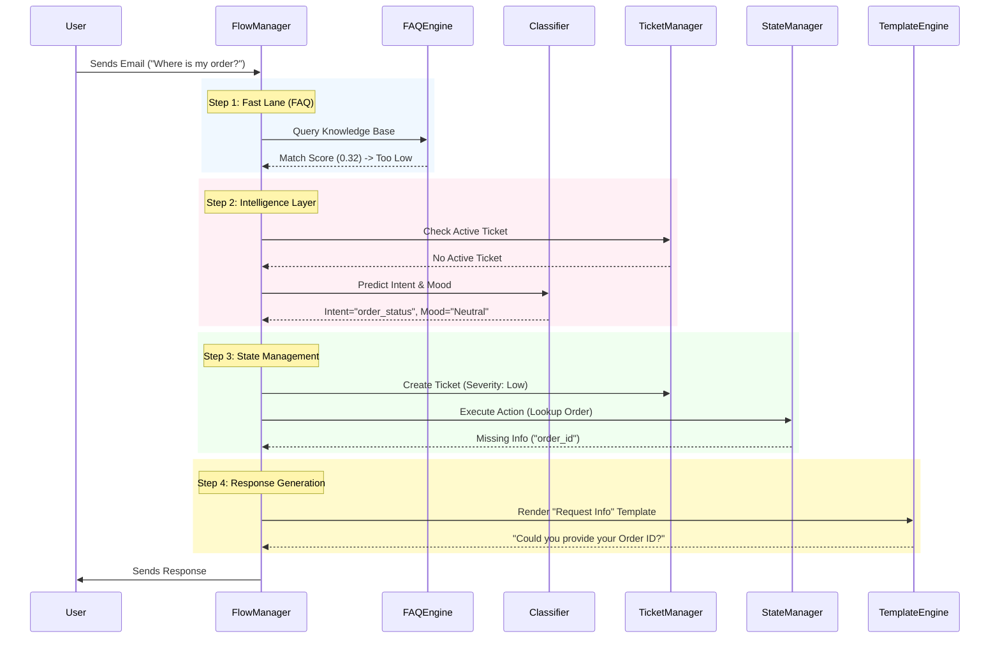

# JUNO Automation Engine 🧠

**Next-Generation AI Customer Support System**

> **Status**: Active Development (Phase 4 Complete)
> **Version**: 1.0.0-alpha
> **Engine**: Hybrid (Rule-Based + Neural Networks)

---

## 📖 1. Executive Summary

The **JUNO Automation Engine** is not just a chatbot; it is a **state-aware, emotionally intelligent autonomous agent** designed to handle complex customer support interactions. Unlike traditional decision trees, JUNO utilizes a hybrid architecture combining **SetFit (Sentence Transformer Fine-tuning)** for accurate mood detection, **Semantic Search** for knowledge retrieval, and **Deterministic Logic** for transactional safety.

The system is designed to:
1.  **Understand Emotion**: It doesn't just read text; it detects urgency, anger, and confusion to prioritize tickets.
2.  **Route Intelligently**: It distinguishes between simple FAQs (handled instantly) and complex issues (routed to humans).
3.  **Fail Gracefully**: It handles edge cases, invalid data, and system errors with professional empathy.

---

## 🏗️ 2. System Architecture

The system follows a **Hub-and-Spoke** architecture, where the `FlowManager` acts as the central orchestrator.

### High-Level Data Flow



---

## 🧩 3. Component Deep Dive

### A. The Brain: Flow Manager (`src/m09_flow_manager.py`)
The **Flow Manager** is the decision-making core. It implements a sophisticated state machine:
*   **FAQ Check**: Uses a high threshold (0.60) to auto-answer general questions.
*   **FAQ Fallback**: If the user asks a question the AI doesn't know (Intent="unknown"), it automatically creates a **Human Handoff Ticket**.
*   **Context Management**: Maintains the conversation context (User ID, Ticket ID, Mood) across turns.

### B. The Heart: Mood & Intent Classifier (`src/m02_intent_classifier.py`)
We moved beyond simple keyword matching to **Few-Shot Learning** using **SetFit**.
*   **Model**: `sentence-transformers/all-MiniLM-L6-v2` fine-tuned on a custom dataset.
*   **Classes**:
    *   **Moods**: `Angry`, `Happy`, `Neutral`, `Confused`, `Urgent`.
    *   **Intents**: `order_status`, `return_policy`, `technical_issue`, etc.
*   **Safety Overrides**: Heuristic rules that override the model to prevent critical failures (e.g., "not happy" is forced to `Angry` even if the model predicts `Happy`).

### C. The Memory: Ticket Manager (`src/m04_ticket_manager.py`)
Manages the lifecycle of customer issues.
*   **Severity Logic**:
    *   🔴 **High**: Mood is `Angry` or `Urgent`.
    *   🟡 **Medium**: Mood is `Confused`.
    *   🟢 **Low**: Mood is `Neutral` or `Happy`.
*   **Persistence**: Currently stores tickets in `jinja_emails/tickets.json` (Mock DB).

### D. The Knowledge: FAQ Engine (`src/m03_faq_engine.py`)
A **Semantic Search** engine that finds the best match for a user's question.
*   **Vector Embeddings**: Encodes the user's query and compares it against the `knowledge_base.json` using **Cosine Similarity**.
*   **Thresholding**: Only returns an answer if similarity > 0.60, ensuring relevance.

### E. The Voice: Template Engine (`src/m07_jinja_email.py`)
Uses **Jinja2** to generate dynamic, personalized emails.
*   **Context Injection**: Injects variables like `user_name`, `order_id`, `tracking_link`, and `severity` into the templates.
*   **Templates**:
    *   `email_order_status.j2`: For transactional updates.
    *   `email_unknown_intent.j2`: For graceful fallbacks.
    *   `email_system_error.j2`: For technical failures.

---

## 🛡️ 4. Robustness & Edge Cases

The system is hardened against common failures:

| Scenario | Handling Strategy | Template Used |
| :--- | :--- | :--- |
| **Unknown Intent** | Admit confusion, list capabilities, create ticket. | `email_unknown_intent.j2` |
| **Invalid Data** | Detect malformed IDs (e.g., "Order ABC"), explain format. | `email_invalid_format.j2` |
| **System Error** | Catch exceptions, log error, create high-priority ticket. | `email_system_error.j2` |
| **Toxic Content** | (Planned) Detect abuse, refuse to engage, flag user. | `email_toxic_response.j2` |

---

## 🌍 5. Real-World Production Roadmap

To take JUNO from a prototype to a global-scale enterprise solution, the following architectural evolution is required:

### Phase 1: Data Persistence & Integrity
*   **Current**: JSON Files (`tickets.json`, `mock_database.json`).
*   **Production**:
    *   **PostgreSQL**: For structured, transactional data (Users, Orders, Tickets). ACID compliance is critical here.
    *   **Redis**: For caching user sessions and "hot" FAQ embeddings to reduce latency.
    *   **Migration**: Replace `TicketManager` file I/O with `SQLAlchemy` ORM.

### Phase 2: Knowledge at Scale (RAG)
*   **Current**: Local In-Memory Embeddings (FAISS/Arrays).
*   **Production**:
    *   **Vector Database**: Use **Pinecone**, **Weaviate**, or **pgvector**. This allows searching millions of documents in milliseconds.
    *   **Hybrid Search**: Combine Semantic Search (Vectors) with Keyword Search (BM25) for maximum accuracy (e.g., matching exact product model numbers).
    *   **RAG (Retrieval-Augmented Generation)**: Instead of static FAQ answers, use an LLM (Gemini/GPT-4) to *generate* the answer based on the retrieved knowledge chunks.

### Phase 3: Advanced Intelligence
*   **Current**: Regex-based Entity Extraction.
*   **Production**:
    *   **LLM Extraction**: Use Gemini Pro to extract complex entities.
        *   *Input*: "I want the red sneakers in size 10 sent to my mom's house."
        *   *Output*: `{ "product": "sneakers", "color": "red", "size": "10", "address_type": "gift" }`
    *   **Active Learning**: Automatically flag "Low Confidence" interactions for human review. Use these corrected examples to re-train the SetFit model weekly.

### Phase 4: Infrastructure & Security
*   **Queue System**: Implement **RabbitMQ** or **Apache Kafka** to decouple email ingestion from processing. This prevents the system from crashing during traffic spikes.
*   **Security**:
    *   **PII Redaction**: Automatically detect and redact credit card numbers/SSNs before sending data to any external LLM.
    *   **RBAC**: Role-Based Access Control for the human agent dashboard.

---

## 🧠 6. Model Training & Data Pipeline

The core intelligence of JUNO comes from a custom-trained **SetFit** model. Here is how we built it:

### Step 1: Synthetic Data Generation 🧬
We used **Gemini Pro** to generate a diverse dataset of 2,500+ examples (`data/mood_training_data.json`).
*   **Strategy**: We specifically asked for "Hard Negatives" and "Nuanced" examples to prevent overfitting.
    *   *Example*: "I'm not exactly thrilled" -> **Angry** (Not Happy).
    *   *Example*: "I need this yesterday!" -> **Urgent**.

### Step 2: Training on Colab ☁️
Due to the computational requirements of Transformer models, training is offloaded to Google Colab.
*   **Script**: `scripts/colab_train_setfit.py`
*   **Process**:
    1.  Load `sentence-transformers/all-MiniLM-L6-v2`.
    2.  Fine-tune using **Cosine Similarity Loss**.
    3.  Evaluate on a hold-out test set.
*   **Performance**: The model achieves **~80% Accuracy** on difficult test cases.

### Step 3: Deployment 📦
The trained model is exported as a zip file and extracted to `models/v2_setfit/`. The `IntentClassifier` loads this local model for inference.

---

## 🚀 7. Installation & Usage

### Prerequisites
*   Python 3.8+
*   Virtual Environment (Recommended)

### Setup
1.  **Clone the Repository**:
    ```bash
    git clone https://github.com/your-repo/juno-engine.git
    cd juno-engine
    ```
2.  **Install Dependencies**:
    ```bash
    pip install -r requirements.txt
    ```

### 3. ⚠️ Model Setup (CRITICAL)
The **Mood Detection Model** (SetFit) is too large for GitHub. You must download it separately.

1.  **Download the Model**: [https://drive.google.com/drive/folders/1ZbHSGBrnqhufV58BtNnMtBxLlyK6-bEZ?usp=sharing]
2.  **Extract**: Unzip the folder.
3.  **Place**: Move the contents into `models/mood_model/`.
    *   Structure should look like: `models/mood_model/model.safetensors`, `config.json`, etc.

### 4. Environment Variables**:
    Create a `.env` file:
    ```
    GEMINI_API_KEY=your_api_key_here
    ```

### Running the Engine
To simulate the email processing flow:
```bash
python -m src.m09_flow_manager
```

### 4. Interactive Demo 🎮
To chat with the system in real-time:
```bash
# Ensure venv is activated
source ../venv/bin/activate

# Run the demo
python scripts/interactive_demo.py
```

#### 🧪 Try these Test Scenarios:

**1. Order Status (Multi-Turn Conversation)**
*   **You**: "Where is my order?"
    *   *System detects intent but missing ID. Asks for clarification.*
*   **You**: "It is #1001"
    *   *System extracts ID, checks DB, and returns "Shipped" status.*

**2. FAQ Query (Instant Answer)**
*   **You**: "What is your return policy?"
    *   *System matches Knowledge Base and replies immediately.*

**3. Human Handoff (Unknown Intent)**
*   **You**: "How do I fly to Mars?"
    *   *System detects unknown intent, creates a ticket, and assigns it to a human agent.*

### 5. Running Tests
*   **Full System Verification**: `python scripts/comprehensive_test.py`
*   **Edge Case Verification**: `python scripts/test_edge_cases.py`

---

## 📂 7. File Structure & Roles

### `config/`
*   `intent_config.json`: Defines rules for each intent (e.g., "order_status" requires "order_id").
*   `knowledge_base.json`: Stores the FAQ questions and answers.
*   `mock_database.json`: Simulates a production database with Orders, Products, and Users.

### `jinja_emails/`
*   `email_*.j2`: Jinja2 templates for generating dynamic email responses.
*   `tickets.json`: Stores active support tickets (JSON-based persistence).

### `models/`
*   `intent_model/`: Contains the **Random Forest** model for Intent Classification (`mood_classifier.joblib`).
*   `mood_model/`: Contains the **SetFit** model for Mood Detection (`setfit_mood_model.zip`).

### `scripts/`
*   `colab_train_setfit.py`: Script to train the SetFit model on Google Colab.
*   `comprehensive_test.py`: **Main Test Suite**. Verifies the entire system end-to-end.
*   `interactive_demo.py`: **Interactive Chat**. Allows you to chat with the bot in real-time.
*   `test_edge_cases.py`: Verifies handling of unknown intents and system errors.
*   `test_mood.py`: Verifies the accuracy of the Mood Detection model.
*   `mood_diagnostics.py`: Analyzes model performance and confusion matrices.

### `src/`
*   `m01_data_loader.py`: Utility to load JSON configs and databases.
*   `m02_intent_classifier.py`: Wrapper for the AI models. Handles prediction and safety overrides.
*   `m03_faq_engine.py`: Semantic Search engine for FAQs.
*   `m04_ticket_manager.py`: Manages ticket creation, updates, and severity logic.
*   `m05_entity_extractor.py`: Extracts entities (Order IDs, Emails) using Regex.
*   `m06_email_state_manager.py`: Executes business logic (DB lookups, validation).
*   `m07_jinja_email.py`: Renders the Jinja2 templates.
*   `m09_flow_manager.py`: **The Core Orchestrator**. Connects all components together.
